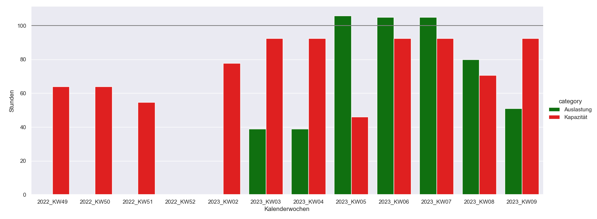
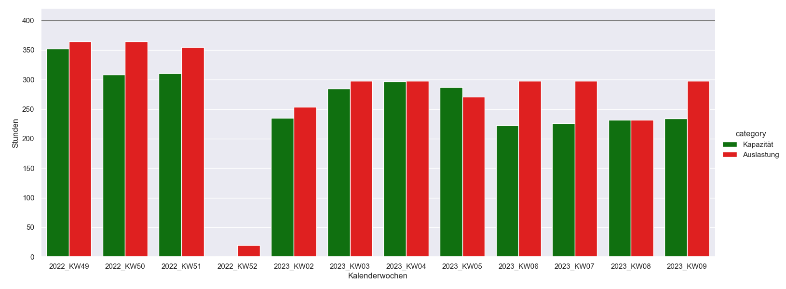
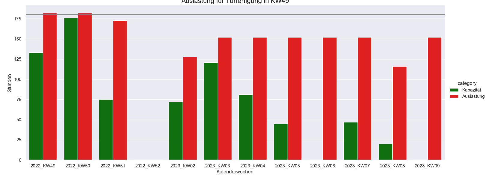
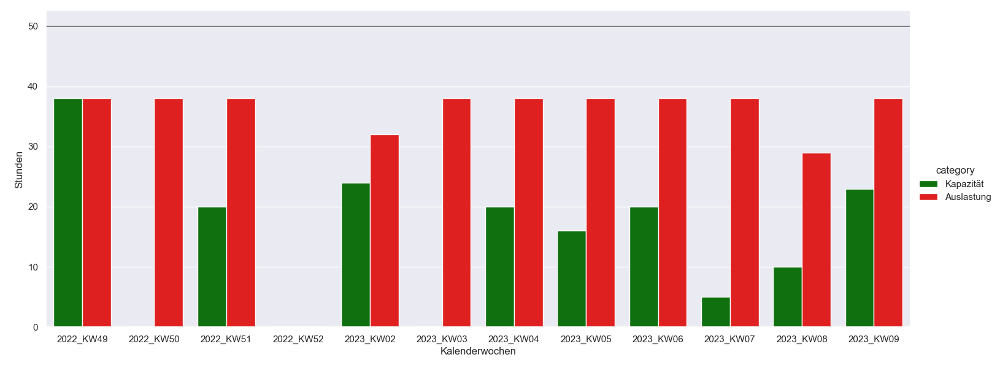
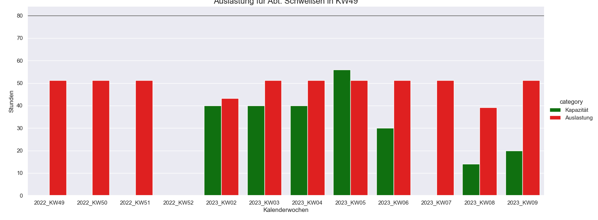
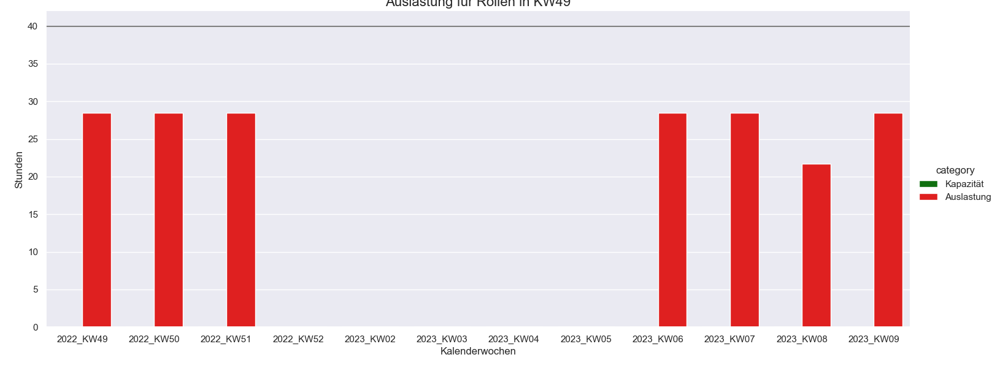

# Übersicht Grafiken Fertigung für die KW 49 
Nachfolgend finden sich die automatisch generierten Berichte über die Auslastung und Kapazität in der Fertigung. 
## Kapazität PR-Fertigung 
 
## Kapazität Fensterfertigung 
 
## Kapazität Türfertigung 
 
## Kapazität Blechfertigung 
 
## Kapazität Abt. Schweißen 
 
## Kapazität Rollen 
 
